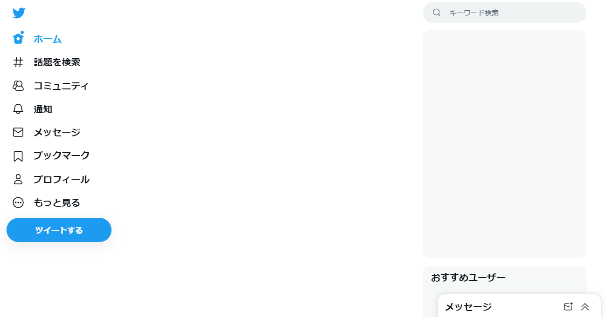

# TwitterScreensaver

Twitter にスクリーンセーバーを導入する Chrome 拡張機能 

# Installation

[releases](https://github.com/fa0311/TwitterScreensaver/releases) の _TwitterScreensaver.zip_ を選択してファイルをダウンロード 
Chrome の _拡張機能の管理_ を選択して _デベロッパーモード_ を有効にした後、ダウンロードした zip ファイルをページにドラッグしてください 

# Config

インストール後、アイコンをクリックするとスクリーンセーバーまでの時間を変更できます 
デフォルトは 300 秒です

# License

TwitterScreensaver is under MIT License
